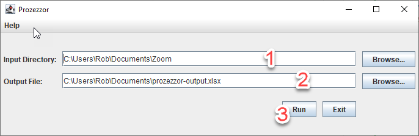

# Prozezzor

## Description

Simple utility for extracting contact information from Zoom chat 
transcripts to an Excel spreadsheet. The application is geared 
toward online business networking 
meetings where participants paste their contact info into the chat. 

It is a common practice in a Zoom networking meeting to save multiple
copies of the chat because the chat is lost if the user is 
disconnected. It is also common practice to post contact information
multiple times during the meeting in order to ensure that all users
received the contact information. This often results in duplicated
data.

Prozezzor will pull the contact information out of the several chat transcripts
and deduplicate the information before outputting the contact information
to a spreadsheet (.xlsx format).

Prozezzor supports command line interface and GUI. It is written in Kotlin.


## Current Status

(14May2021)

We have released version 1.0.0 of the application, which includes Windows and
Mac installer packages. This version also includes several updates for
changes to the Zoom chat transcript format, and a number of other small bug
fixes and feature enhancements since the pre-release versions.

## Download

By downloading or installing our prebuilt packages, you agree to the terms of
the [EULA](https://github.com/reusabit/prozezzor/blob/master/src/installer/resources/eula_for_installer.txt).
Note, the EULA for the binary packages is different than the license for the source code. (Unfortunately, we cannot make the installer
package available under same Apache-2.0 license as the source code. However,
the source code is Apache-2.0 licensed, and it does include a build script...)

[Windows (x64)](https://github.com/reusabit/prozezzor/releases/download/v1.0.0/Prozezzor_windows-x64_1_0_0.exe)

[Macos (x64)](https://github.com/reusabit/prozezzor/releases/download/v1.0.0/Prozezzor_macos_1_0_0.dmg)

## Build Instructions

Alternatively, the adventurous may compile the application by following 
these instructions:

1. Install Java JDK, such as 
   [Amazon Corretto 11](https://docs.aws.amazon.com/corretto/latest/corretto-11-ug/downloads-list.html)
2. Ensure that the JAVA_HOME environment variable is set to the JDK
   installation directory.
3. Download the source from github https://github.com/reusabit/prozezzor
4. Run ```./gradlew installDist```
5. The application will be built in ```build/install/prozezzor```. Run
   the appropriate script from the ```bin``` subdirectory.

## Usage

The application recursively processes a single input directory 
looking for text files which have a ```.txt``` file extension.

The application outputs the combined, deduplicated information to
a single spreadsheet.

Currently, the application processes all files in the input directory.
There is not a mechanism to select only specific files. However,
it is always possible to construct a new directory with the desired
files.

Usage information is available with the ```--help``` command line
option.

## GUI

Run the application with the ```--gui``` flag:

```
$ ./prozezzor --gui
```



Steps:
1. Enter the input directory. This defaults to the location where
   Zoom stores the chat transcripts.
2. Enter the name of the Excel spreadsheet that will be created.
3. Click "Run".

## Command Line Usage

See usage information by invoking with ```--help``` option.

Example:

```
$ ./prozezzor -y -f \
--input-directory /cygdrive/c/Users/Rob/Documents/Zoom/ \
--output-file /cygdrive/c/Users/Rob/Documents/prozezzor.xlsx
```

## Contact

Prozezzor is written by Reusabit Software LLC ([https://reusabit.com](https://reusabit.com)).

Contact: Rob Pulsipher - rob@reusabit

## License

Apache 2.0

See LICENSE.txt for details.
